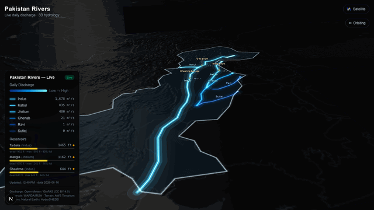

# Pakistan Rivers — Live

A 3D, real-time visualization of Pakistan's major rivers and reservoirs. The country's
six largest rivers — the **Indus, Kabul, Jhelum, Chenab, Ravi, and Sutlej** — glow and
pulse across real 3D terrain, with the brightness and animation speed of each river driven
by its actual daily water discharge. Pakistan's big dams (**Tarbela, Mangla, Chashma**)
appear as luminous water vessels whose fill level reflects the current reservoir level.

Built in a day with [Claude](https://claude.ai) — I'd always wanted to see Pakistan's
rivers as live, visual data, so I made it.



> **Live demo:** _add your deployed URL here_

---

## What you're looking at

| Element | What it shows |
| --- | --- |
| **Glowing blue rivers** | The six major rivers. Color and glow intensity map to how much water is flowing. |
| **Animated comet pulses** | Travel downstream along each river. They move faster and have longer trails when discharge is higher. |
| **Glowing dam towers** | Each reservoir as a "water vessel" — a wireframe cage marks full capacity, and the amber water inside rises to the real fill level. |
| **Fill % labels** | The live percentage full, shown beside each dam. |
| **Legend (bottom-left)** | Per-river discharge in m³/s, reservoir levels in feet, and data freshness. |
| **Pakistan outline** | The national border, drawn from Natural Earth data. |

Use the controls (top-right) to **toggle the satellite/dark basemap** and **start/stop the
slow auto-orbit camera** (handy for screen recordings). Dragging the map pauses the orbit.

---

## Where the data comes from

All data is fetched live and cached server-side, with graceful fallbacks so the app never
renders blank.

- **River discharge** — [Open-Meteo Flood API](https://open-meteo.com/en/docs/flood-api),
  which serves [GloFAS](https://global-flood.emergency.copernicus.eu/) (Global Flood
  Awareness System) daily river discharge. _License: CC BY 4.0._
- **Reservoir / dam levels** — Pakistan's [WAPDA](https://www.wapda.gov.pk/) and
  [IRSA](https://www.irsa.gov.pk/) daily water-situation reports. These pages are scraped
  tolerantly; when they're unreachable (they often block bots), the app falls back to
  typical seasonal levels and labels them as estimated.
- **3D terrain elevation** — [AWS Terrarium](https://registry.opendata.aws/terrain-tiles/)
  elevation tiles (exaggerated 3× for dramatic relief).
- **Basemap tiles** — [CARTO Dark Matter](https://carto.com/basemaps/) (dark) and
  [Esri World Imagery](https://www.esri.com/) (satellite).
- **River & border geometry** — [Natural Earth](https://www.naturalearthdata.com/) and
  [HydroSHEDS](https://www.hydrosheds.org/).

---

## Tech stack

- **[Next.js](https://nextjs.org/)** (App Router) + **TypeScript**
- **[deck.gl](https://deck.gl/)** for the WebGL 3D rendering — `TerrainLayer`, `TripsLayer`,
  `PathLayer`, `ColumnLayer`, `ScatterplotLayer`, `TextLayer`
- **[Tailwind CSS](https://tailwindcss.com/)** for the UI overlay
- Free, key-less map tiles only — **no Mapbox token required**

The neon look comes from stacking several additive-blended layers per river (wide soft
bloom down to a thin white-hot core) on a dark basemap, so light mathematically adds up
into a glow.

---

## Getting started

```bash
# install dependencies
npm install

# run the dev server
npm run dev
```

Open [http://localhost:3000](http://localhost:3000) in your browser.

### Other scripts

```bash
npm run build   # production build
npm run start   # serve the production build
npm run lint    # lint with ESLint
```

---

## How it works

```
app/
  page.tsx                 Client page: hosts the map + UI overlays
  api/snapshot/route.ts    Server route: fetches discharge + dam levels, caches 1h
components/
  MapScene.tsx             The deck.gl scene (terrain, rivers, dams, labels, camera)
  Legend.tsx               Bottom-left legend panel
lib/
  openMeteo.ts             River sample points + discharge fetching
  wapda.ts                 Reservoir-level scraping with fallbacks
  rivers.ts                River + dam metadata
public/
  rivers.geojson           River geometry
  pakistan-border.geojson  National border
```

The browser calls `/api/snapshot`, which fetches all river discharge and dam levels in
parallel, normalizes them (log scale), maps each river to a color/speed/trail length, and
returns a single JSON snapshot. The result is cached in memory for one hour. If a fetch
fails, the last good snapshot (or sensible fallback values) is served so the visualization
stays up.

---

## Deploy

This is a standard Next.js app and deploys to [Vercel](https://vercel.com/) with no extra
configuration — connect the repo and deploy. No environment variables or API keys are
required.

---

## Attribution

Discharge data © Open-Meteo / GloFAS (CC BY 4.0). Reservoir data from WAPDA / IRSA. Terrain
from AWS Terrarium. River and border geometry from Natural Earth and HydroSHEDS. Basemaps
from CARTO and Esri.

Built with [Claude](https://claude.ai).
